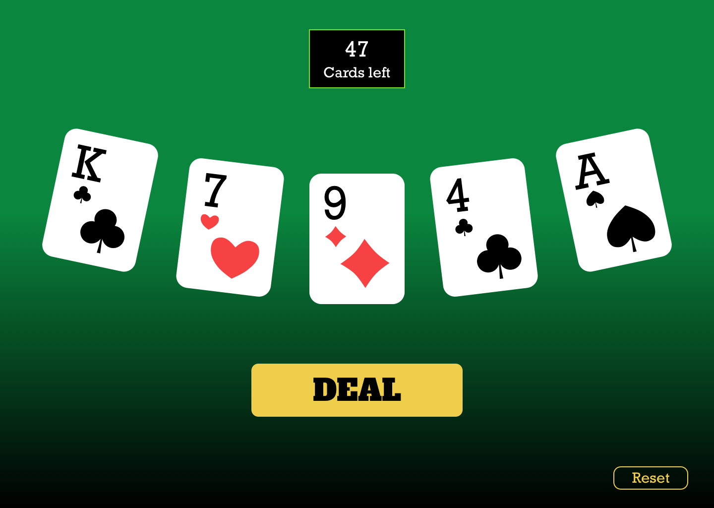
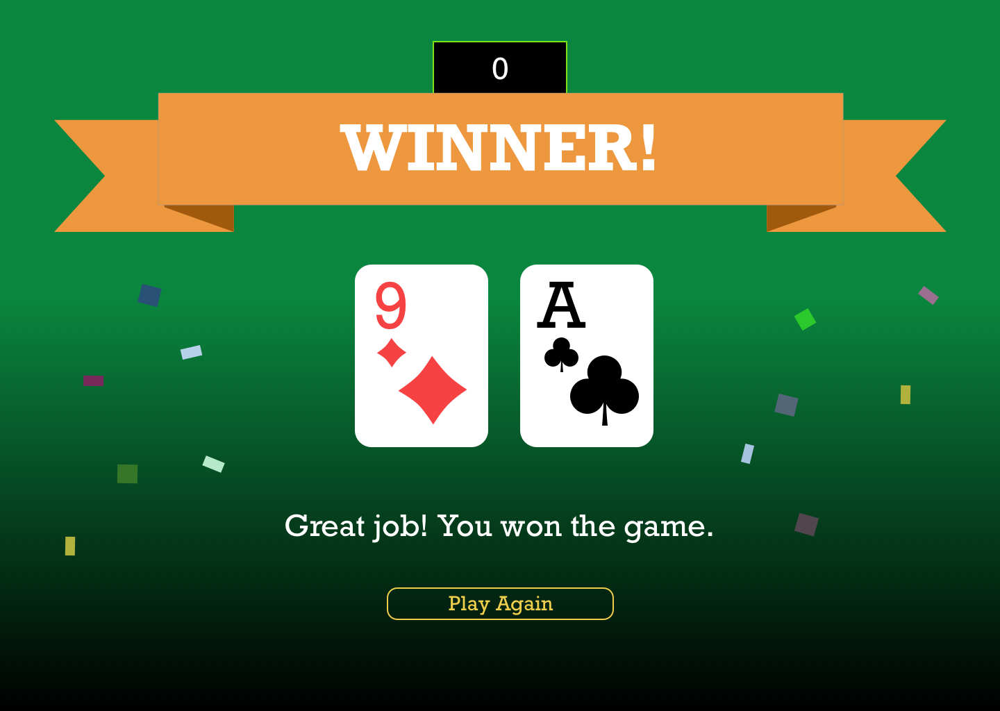

# Uplift Interview

Welcome!

## Intro

This repository contains the Uplift coding "challenge", if you can call it that.
We believe in letting you work as freely as you want within the constraints of
this setup. Our goals are to assess:

- that you can follow specs/requirement docs, making pragmatic decisions along the way
- your level of expertise (mid-level=good approach, expert level=teach us something we don't know)

## Table of Contents

1. [Challenge criteria](#challenge-criteria)
1. [General instructions](#general-instructions)
1. [React Native challenge](#react-native-challenge)

## Challenge criteria

- overall architecture and code quality (readability, decoupledness, etc)
- file structure
- naming
- test coverage (see instructions for [running tests](#running-tests))
- proficiency

## General instructions

- Please lint and explain your code (even just briefly).
- After completing the challenge to a level that you're satisfied shows off your expertise,
  open a pull request against master
- In your PR add a description explaining anything you think is worthwhile, and/or just summarizing
  your approach.
- The repo uses CircleCI to run tests and lint checks on your PR. We'd like to see those passing.

## React Native challenge

The task is to build a simple card game. See [design folder](./design) or [Sketch Cloud](https://www.sketch.com/s/40cd1ec0-8487-4053-a6ea-5d9a70076ebb) for what it should look like. It doesn't have to be pixel perfect, but it should look nice.

The program should perform the following functions.

1. Assuming a standard deck (52 cards of 4 suits: ♣ Clubs, ♦ Diamonds, ♥ Hearts, ♠ Spades).
2. Press a "Deal" button to deal 5 random cards.
3. Pressing the button again should deal 5 unique, random cards. Within the same game, you should never get the same cards again that you got in the past (just like a physical deck).
4. Add a card counter which shows how many cards are dealt/left.
5. Add a button to reset the game.
6. When all the cards have been dealt, Game Over should be displayed.
7. If there is an ace in the last draw, display You Win, otherwise display You Lose, Sucker.
8. Bonus: Animations. Wow us!

Please write tests.

Feel free to use any additional libraries.

Note that the design is not mobile friendly, so use an iPad/tablet as a target device.

[Example implementation (web)](https://drive.google.com/file/d/1uIYhG-74wrWs7YZx6Zz9Bdn3WSEtaIWY/view?usp=sharing)

### Design

### Requirements

- Node 12+ (tested on 12.3.1)
- Yarn 1+ (tested on 1.16.0)

### Getting Started

You are welcome to use expo or set up React Native yourself. The only requirement is that it works on the latest macOS/Xcode.

Please make sure the following yarn scripts are implemeneted:

Start development server:

      yarn start

Run tests, lint, prettier:

      yarn test
